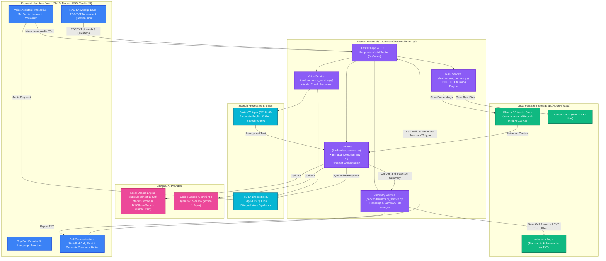

# VoiceAI: System Architecture Diagram

```mermaid
flowchart TD
    %% Styling
    classDef client fill:#3b82f6,stroke:#1d4ed8,stroke-width:2px,color:#fff;
    classDef backend fill:#8b5cf6,stroke:#6d28d9,stroke-width:2px,color:#fff;
    classDef ai fill:#ec4899,stroke:#be185d,stroke-width:2px,color:#fff;
    classDef speech fill:#06b6d4,stroke:#0e7490,stroke-width:2px,color:#fff;
    classDef storage fill:#10b981,stroke:#047857,stroke-width:2px,color:#fff;

    subgraph Client ["Frontend User Interface (HTML5, Modern CSS, Vanilla JS)"]
        UI_Nav["Top Bar: Provider & Language Selectors"]:::client
        UI_Voice["Voice Assistant: Interactive Mic Orb & Live Audio Visualizer"]:::client
        UI_RAG["RAG Knowledge Base: PDF/TXT Dropzone & Question Input"]:::client
        UI_Call["Call Summarization: Start/End Call, Explicit 'Generate Summary' Button"]:::client
    end

    subgraph FastAPIServer ["FastAPI Backend (D:\\VoiceAI\\backend\\main.py)"]
        API_Gateway["FastAPI App & REST Endpoints + WebSocket (/ws/voice)"]:::backend
        AIService["AI Service (backend/ai_service.py)<br/>• Bilingual Detection (EN / HI)<br/>• Prompt Orchestration"]:::backend
        VoiceService["Voice Service (backend/voice_service.py)<br/>• Audio Chunk Processor"]:::backend
        RAGService["RAG Service (backend/rag_service.py)<br/>• PDF/TXT Chunking Engine"]:::backend
        SummaryService["Summary Service (backend/summary_service.py)<br/>• Transcript & Summary File Manager"]:::backend
    end

    subgraph SpeechEngines ["Speech Processing Engines"]
        STT["Faster-Whisper (CPU int8)<br/>Automatic English & Hindi Speech-to-Text"]:::speech
        TTS["TTS Engine (pyttsx3 / Edge-TTS / gTTS)<br/>Bilingual Voice Synthesis"]:::speech
    end

    subgraph AIProviders ["Bilingual AI Providers"]
        Ollama["Local Ollama Engine (http://localhost:11434)<br/>Models stored in D:\\OllamaModels (llama3.1:8b)"]:::ai
        Gemini["Online Google Gemini API<br/>(gemini-1.5-flash / gemini-1.5-pro)"]:::ai
    end

    subgraph LocalStorage ["Local Persistent Storage (D:\\VoiceAI\\data)"]
        ChromaDB["ChromaDB Vector Store<br/>(paraphrase-multilingual-MiniLM-L12-v2)"]:::storage
        Uploads["data/uploads/ (PDF & TXT files)"]:::storage
        Recordings["data/recordings/ (Transcripts & Summaries as TXT)"]:::storage
    end

    %% Connections
    UI_Voice -->|"Microphone Audio / Text"| API_Gateway
    UI_RAG -->|"PDF/TXT Uploads & Questions"| API_Gateway
    UI_Call -->|"Call Audio & 'Generate Summary' Trigger"| API_Gateway

    API_Gateway --> VoiceService
    API_Gateway --> AIService
    API_Gateway --> RAGService
    API_Gateway --> SummaryService

    VoiceService --> STT
    VoiceService --> TTS
    STT -->|"Recognized Text"| AIService
    AIService -->|"Synthesize Response"| TTS
    TTS -->|"Audio Playback"| UI_Voice

    AIService -->|"Option 1"| Ollama
    AIService -->|"Option 2"| Gemini

    RAGService -->|"Store Embeddings"| ChromaDB
    RAGService -->|"Save Raw Files"| Uploads
    ChromaDB -->|"Retrieved Context"| AIService

    SummaryService -->|"Save Call Records & TXT Files"| Recordings
    AIService -->|"On-Demand 5-Section Summary"| SummaryService
    SummaryService -->|"Export TXT"| UI_Call
```
